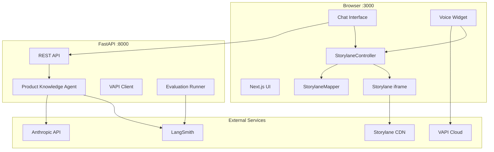

# DemoPilot — Product Requirements Document

**Version:** 1.0  
**Last updated:** July 2026  
**Status:** MVP / Demo-ready

---

## 1. Executive summary

DemoPilot is an **agentic product demo platform** that lets sales engineers, solutions architects, and prospects explore a Carbon Black (endpoint security) product through natural language. Users ask questions in **chat** or **voice**; the system **answers** from ingested product documentation and **acts** by navigating an interactive Storylane dashboard to the relevant section.

The MVP proves a vertical slice: **perceive → retrieve → reason → act**, with optional observability and evaluation via LangSmith.

---

## 2. Problem statement

### Current pain points

- Static product demos require manual clicking and memorization of dashboard paths
- Prospects ask ad-hoc questions that generic slide decks cannot answer
- Sales engineers context-switch between documentation, live consoles, and demo environments
- No unified experience combining **grounded answers** with **visual demo navigation**

### Opportunity

Combine RAG-based product knowledge, voice UX, and interactive demo orchestration into a single interface that mirrors how a human SE would run a discovery call.

---

## 3. Goals and success metrics

### Primary goals (MVP)

| Goal | Success criteria |
|------|------------------|
| Answer product questions accurately | RAG responses grounded in Carbon Black documentation |
| Navigate demo on intent | ≥7 mapped question patterns route to correct Storylane section |
| Support multimodal input | Chat and voice both trigger navigation |
| Demo reliability | App starts locally in &lt;5 min with documented setup |

### Secondary goals (post-MVP)

| Goal | Success criteria |
|------|------------------|
| Evaluation quality | LangSmith eval scores ≥4/5 on helpfulness, accuracy, relevance |
| Production readiness | Durable doc ingestion, CI eval gates, multi-product support |

### Non-goals (MVP)

- Multi-tenant auth and user management
- Production deployment and scaling
- Full VAPI server webhook integration for all voice events
- Replacing Storylane with a live product console

---

## 4. Target users

| Persona | Need |
|---------|------|
| **Sales Engineer** | Run interactive demos without memorizing every dashboard path |
| **Solutions Architect** | Answer technical questions with cited, accurate product context |
| **Prospect / Buyer** | Self-serve exploration via chat or voice during a guided session |
| **Hiring Manager / Evaluator** | See agent architecture: RAG, action layer, observability |

---

## 5. User stories

### Epic 1: Interactive dashboard navigation

| ID | Story | Acceptance criteria |
|----|-------|---------------------|
| US-1.1 | As a user, I want to see an embedded Storylane demo so I can explore the Carbon Black console visually | Iframe loads share URL on Interactive Dashboard tab |
| US-1.2 | As a user, I want my question to navigate the demo to the right section | Mapped queries change iframe URL to correct `page_id` |
| US-1.3 | As a user, I want to reset the demo to the main view | Home button returns to base share URL |

**Mapped sections (MVP):**

| Question theme | Dashboard section | Storylane target |
|----------------|-------------------|------------------|
| Platforms / OS support | Settings | `page_id=8d6bd75d-b8fe-4691-b925-cdf616e84b9c` |
| API access / integrations | Settings | `page_id=769cd63f-b3d4-4fdd-9513-472a7bd6730c` |
| Fileless / LotL attacks | Alerts | Storylane preview link |
| Alert prioritization / tuning | Alerts | `page_id=2552848c-8c2a-4b6d-b421-e8f9d780eced` |
| Automated response / policies | Enforce → Policies | `page_id=9a80dff6-0cb1-42e0-82ab-d4fc6b50ad40` |
| Malware removal | Enforce → Malware removal | Storylane preview link |
| Management console walkthrough | Settings | Base share URL |

### Epic 2: Product knowledge chat

| ID | Story | Acceptance criteria |
|----|-------|---------------------|
| US-2.1 | As a user, I want to type a product question and get an answer | Chat tab shows input, sends to `/api/v1/knowledge/query`, displays response |
| US-2.2 | As a user, I want answers grounded in official documentation | Agent retrieves context from FAISS vector store before generating |
| US-2.3 | As a user, I want chat queries to also drive demo navigation | `onQueryReceived` fires navigation handler on send |

### Epic 3: Voice interaction

| ID | Story | Acceptance criteria |
|----|-------|---------------------|
| US-3.1 | As a user, I want to start a voice session with one click | Mic FAB starts VAPI call using public key + assistant ID |
| US-3.2 | As a user, I want my spoken question to navigate the dashboard | Final user transcript triggers `StorylaneController.handleQuery` |
| US-3.3 | As a user, I want voice confirmation of what was heard | System message acknowledges transcript |

### Epic 4: Observability and evaluation (optional)

| ID | Story | Acceptance criteria |
|----|-------|---------------------|
| US-4.1 | As a developer, I want traces of LLM calls | LangSmith tracing when `LANGSMITH_TRACING=true` |
| US-4.2 | As a developer, I want automated quality scoring | Eval runners score helpfulness, accuracy, relevance via LLM-as-judge |

---

## 6. Functional requirements

### 6.1 Frontend (Next.js 15)

- Material UI layout with two tabs: Interactive Dashboard, Chat Interface
- Storylane iframe with header (section chip, refresh, home)
- `StorylaneMapper` — keyword and exact-match query → section URL
- `StorylaneController` — iframe navigation, events, reset
- `ChatInterface` — message list, input, backend API integration
- `VoiceWidget` — VAPI Web SDK, assistant-based calls
- API proxy via `next.config.mjs` rewrites (`/api/*` → backend)

### 6.2 Backend (FastAPI)

- Startup lifespan: initialize knowledge agent (scrape docs, build FAISS index)
- `POST /api/v1/knowledge/query` — RAG + Claude Haiku 4.5 response
- VAPI webhook and speak endpoints (server-side)
- Evaluation API routes (LangSmith, optional)
- Pydantic settings from `.env` with `extra="ignore"` for mixed env files

### 6.3 Knowledge agent

- **Ingestion:** Scrape Broadcom Carbon Black URLs on startup
- **Chunking:** 1000 chars, 200 overlap
- **Embeddings:** OpenAI if key present, else HuggingFace `all-MiniLM-L6-v2`
- **Vector store:** FAISS in-memory
- **Generation:** Claude Haiku 4.5 (`claude-haiku-4-5-20251001`)
- **Fallback:** Hardcoded product info if scrape fails

### 6.4 Voice (VAPI)

- Client-side: `@vapi-ai/web` with public key
- Assistant ID from dashboard (not inline model config)
- Transcript → navigation (backend webhook not required for MVP demo)

---

## 7. Non-functional requirements

| Category | Requirement |
|----------|-------------|
| **Latency** | Chat response &lt;10s after agent warm-up; voice turn &lt;2s perceived |
| **Availability** | Local dev demo; no SLA for MVP |
| **Security** | API keys in `.env` / `.env.local`; never commit secrets |
| **Compatibility** | Chrome/Safari latest; macOS dev environment |
| **Maintainability** | Centralized Storylane URLs in `storylaneMapper.ts` and `storylaneConfig.ts |

---

## 8. System architecture

### Agent loop

1. **Perceive** — User query via chat transcript or voice STT
2. **Retrieve** — FAISS similarity search over product docs
3. **Reason** — Claude generates grounded answer (chat path)
4. **Act** — `StorylaneController` navigates iframe to mapped section

---

## 9. Data requirements

### Environment variables

**Backend (`.env`):**

| Variable | Required | Purpose |
|----------|----------|---------|
| `ANTHROPIC_API_KEY` | Yes | LLM generation |
| `VAPI_API_KEY` | Yes | Server-side VAPI |
| `VAPI_ASSISTANT_ID` | Yes | Assistant reference |
| `STORYLANE_SHARE_ID` | Yes | Demo share ID |
| `OPENAI_API_KEY` | No | Embeddings |
| `LANGSMITH_*` | No | Tracing and evaluation |

**Frontend (`frontend/.env.local`):**

| Variable | Required | Purpose |
|----------|----------|---------|
| `NEXT_PUBLIC_VAPI_PUBLIC_KEY` | Yes | VAPI Web SDK |
| `NEXT_PUBLIC_VAPI_ASSISTANT_ID` | Yes | Voice assistant |
| `NEXT_PUBLIC_BACKEND_API_URL` | No | Defaults to localhost:8000 |

### Documentation sources (MVP)

- Broadcom Carbon Black product pages
- Carbon Black EDR datasheet
- Configurable via `initialize_agent()` URL list

---

## 10. UX requirements

- Mobile-first not required; optimized for laptop demo / screen share
- Chat: empty-state placeholder, loading indicator, input pinned to bottom
- Dashboard: section chip shows current navigation target
- Voice: FAB bottom-right; mic on/off states; error alerts on misconfiguration
- Debug buttons on home page for reliable demo triggers (can be hidden for production)

---

## 11. Evaluation and quality

### LLM-as-judge criteria (LangSmith)

| Criterion | Scale | Pass threshold |
|-----------|-------|----------------|
| Helpfulness | 1–5 | ≥4 |
| Accuracy | 1–5 | ≥4 |
| Relevance | 1–5 | ≥4 |

### Manual demo test checklist

- [ ] Backend starts without import errors
- [ ] Storylane iframe loads
- [ ] "Test: API Access" navigates correctly
- [ ] Chat returns answer for "What platforms are supported?"
- [ ] Voice mic starts session (with mic permission)
- [ ] "show me the alerts" navigates via voice or debug button

---

## 12. Risks and mitigations

| Risk | Impact | Mitigation |
|------|--------|------------|
| Storylane page IDs change | Navigation breaks | Centralize URLs; document update process |
| First-boot scrape slow | Demo delay | Start backend early; add fallback content |
| VAPI SDK / daily-js warnings | Console noise | Upgrade `@vapi-ai/web`; use assistant ID |
| LangChain version drift | Import errors | Pin `langchain>=0.3,<1.0` |
| Chat on wrong tab doesn't show navigation | Confusing UX | Demo script: navigate on Dashboard tab |

---

## 13. Roadmap

### Phase 1 — MVP (current)

- [x] Storylane embed + query-driven navigation
- [x] RAG chat with Anthropic
- [x] VAPI voice with transcript navigation
- [x] LangSmith eval framework
- [x] Local dev documentation

### Phase 2 — Production hardening

- [ ] Durable embedding store (not in-memory FAISS)
- [ ] Scheduled doc ingestion with versioning
- [ ] Remove debug UI; production Storylane mapping admin
- [ ] CI eval regression gates
- [ ] `ANTHROPIC_MODEL` in settings (env-driven)

### Phase 3 — Scale

- [ ] Multi-product support (Prisma Cloud, CrowdStrike, etc.)
- [ ] VAPI server webhooks for full voice ↔ backend loop
- [ ] Analytics: query → section match rate, session duration
- [ ] Optional ngrok / deploy for remote demos

---

## 14. Open questions

1. Should chat navigation switch to Dashboard tab automatically when a section match is found?
2. Are Storylane preview URLs (`/preview/...`) stable enough for production navigation, or should all targets use `share/...?page_id=` format?
3. Should the knowledge agent product type switch via env var (`carbon_black` vs `prisma_cloud`)?
4. Is voice LLM configured in VAPI dashboard sufficient, or should responses also call the RAG backend?

---

## 15. References

- Storylane share: `https://app.storylane.io/share/zjalh0zmyhdm`
- [VAPI Dashboard](https://dashboard.vapi.ai)
- [Anthropic Models](https://platform.claude.com/docs/en/about-claude/models/overview)
- [LangSmith Evaluation Guide](../LANGSMITH_EVALUATION_GUIDE.md)
